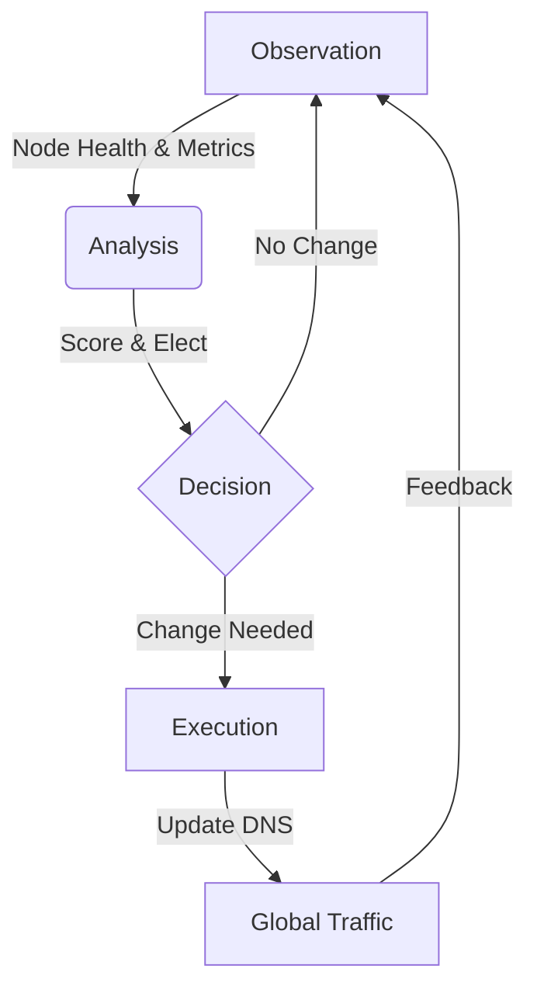

# Coordination System: The Brain of Intelligent Traffic Scheduling

## 📖 Introduction
**Coordination System** is a high-availability traffic scheduling system designed to optimize global content delivery. It acts as the "Central Nervous System" for a CDN network, automatically routing user traffic to the best available nodes based on real-time health, latency, and geographic data.

It solves three critical problems:
1.  **Downtime**: What happens when a server crashes? (Automated Failover)
2.  **Latency**: How to ensure users connect to the fastest server? (Smart Routing)
3.  **Control**: How to manually override traffic during maintenance? (Manual Dispatch)

---

## 🏗 Architecture: The O.A.E. Loop

The system follows the **Observation -> Analysis -> Execution** design pattern, ensuring a continuous feedback loop.

### 1. 👁️ Observation (The Eyes)
*   **Component**: `Scheduler / Registry`
*   **Tech**: `Asynq` (Distributed Task Queue)
*   **Function**:
    *   Periodically scans thousands of edge nodes.
    *   Collects metrics: CPU load, bandwidth usage, HTTP error rates, and latency.
    *   Aggregates data into `Redis` for fast access.

### 2. 🧠 Analysis (The Brain)
*   **Component**: `Rule Engine`
*   **Tech**: Custom Go Logic
*   **Process**:
    *   **Filtering**: Excludes nodes that are down (`HealthCheck=Fail`) or marked for maintenance.
    *   **Scoring**: Ranks remaining nodes based on weighted criteria (e.g., `Latency * 0.6 + Load * 0.4`).
    *   **Election**: Selects the single best candidate node for a specific region.

### 3. 🖐️ Execution (The Hands)
*   **Component**: `Action Executor`
*   **Tech**: DNS Provider API Integration
*   **Function**:
    *   Receives the "Elected Node" from the Analysis phase.
    *   Updates the authoritative DNS records (`A` or `CNAME`).
    *   **Example**: Changes `video.example.com` from resolving to `1.2.3.4` (US Node) to `5.6.7.8` (SG Node) instantly.

---

## ✨ Key Features

### 🛡️ Automated Failover (Self-Healing)
When a node fails (e.g., power outage), the system detects the heartbeat loss within seconds. It automatically triggers a "Re-Election" and updates DNS records to point to a healthy backup node, ensuring **Zero Downtime** for end-users.

### 🔧 Manual Dispatch (g > y > IP)
For granular control, we implemented a 3-layer mapping model:
*   **g (Global Domain)**: The user-facing domain (e.g., `www.app.com`).
*   **y (Site ID)**: An internal abstraction representing a logical site.
*   **IP (Physical Node)**: The actual server IP.

**Benefit**: Ops teams can manually lock a `g` domain to a specific `y` site, or switch a `y` site to a different `IP` without affecting the public domain structure.

### 🎯 Smart Geo-Routing
The system respects "Service Areas". A user in **Southeast Asia** will only be routed to nodes tagged with `Region: SEA`, ensuring data sovereignty and lowest latency.

---

## 🛠 Technology Stack

| Layer | Technology | Usage |
| :--- | :--- | :--- |
| **Language** | **Golang** | Core logic, high concurrency handling. |
| **Queue** | **Asynq** | Reliable distributed task scheduling. |
| **Storage** | **Redis** | Real-time state and cache. |
| **Config** | **etcd** | Dynamic configuration management. |
| **API** | **RESTful (Gin)** | Internal communication and external control. |